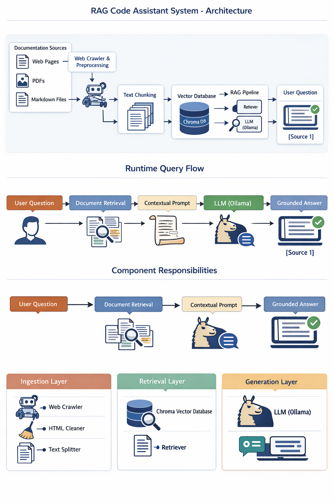

# RAG Code Assistant (Documentation-Aware)

A **Retrieval-Augmented Generation (RAG) based Code Assistant** designed to answer questions **strictly from provided documentation**. This project is optimized for **technical documentation (e.g., Spring Docs, APIs, internal wikis)** and uses **local LLMs via Ollama**, ensuring privacy, determinism, and low cost.

---

## 1. Key Features

* Documentation-only answers (hallucination resistant)
* Local LLM inference using **Ollama** (DeepSeek-Coder)
* Vector-based semantic search using **ChromaDB**
* High-quality embeddings via **HuggingFace Sentence Transformers**
* Sitemap-aware web crawling
* Config-driven architecture
* Modular, production-ready RAG pipeline
* Gradio-based UI (optional)

---

## 2. Architecture Overview



---

## 3. Technology Stack

| Layer         | Technology                              |
| ------------- | --------------------------------------- |
| LLM           | Ollama (deepseek-coder:6.7b)            |
| Embeddings    | sentence-transformers/all-mpnet-base-v2 |
| Vector DB     | Chroma                                  |
| RAG Framework | LangChain                               |
| UI            | Gradio                                  |
| Parsing       | BeautifulSoup                           |
| Language      | Python 3.10+                            |

---

## 4. Project Structure

```
project-root/
│
├── config/
│   └── settings.py          # Centralized configuration
│
├── ingestion/
│   ├── crawler.py           # Web crawler & sitemap discovery
│   ├── html_utils.py        # HTML cleaning utilities
│   └── loader.py            # Document loaders
│
├── vectorstore/
│   └── manager.py           # VectorStoreManager (Chroma)
│
├── rag/
│   └── rag_chain.py         # RAGChain implementation
│
├── ui/
│   └── app.py               # Gradio UI
│
├── gradio_db/               # Persisted vector database
├── requirements.txt
└── README.md
```

---

## 5. Configuration (`config/settings.py`)

All system behavior is controlled via a single configuration file.

### LLM

```python
LLM_MODEL = "deepseek-coder:6.7b"
LLM_TEMPERATURE = 0
```

* Deterministic outputs
* Code-focused model

### Embeddings

```python
EMBEDDING_MODEL = "sentence-transformers/all-mpnet-base-v2"
```

### Chunking

```python
CHUNK_SIZE = 1500
CHUNK_OVERLAP = 300
```

### Retrieval (MMR)

```python
RETRIEVAL_SEARCH_TYPE = "mmr"
RETRIEVAL_K = 8
RETRIEVAL_FETCH_K = 20
```

### Persistence

```python
PERSIST_DIRECTORY = "./gradio_db"
```

---

## 6. HTML Cleaning

HTML is cleaned before embedding to remove noise:

```python
HTML_REMOVE_TAGS = ['script', 'style', 'nav', 'footer', 'header']
```

This ensures embeddings represent **only meaningful documentation content**.

---

## 7. Vector Store Management

Handled by `VectorStoreManager`:

* Splits documents using `RecursiveCharacterTextSplitter`
* Creates and persists Chroma vector store
* Provides retriever configured with MMR
* Supports safe deletion and re-ingestion

---

## 8. RAG Chain Behavior

The `RAGChain` enforces:

* Documentation-only answers
* Explicit fallback if answer is not found
* Source-aware context formatting
* Deterministic, repeatable responses

Prompt guarantees:

* No training-knowledge leakage
* No hallucinated APIs or syntax

---

## 9. Running the Project

### Step 1: Install Dependencies

```bash
pip install -r requirements.txt
```

### Step 2: Install & Run Ollama

```bash
ollama pull deepseek-coder:6.7b
ollama serve
```

### Step 3: Launch UI

```bash
python ui/app.py
```

Access at:

```
http://127.0.0.1:7860
```

---

## 10. Example Query Behavior

**User:**

> How does Spring Boot auto-configuration work?

**Assistant:**

* Searches documentation vectors
* Injects relevant chunks
* Answers strictly from docs
* Cites exact documentation sources

If not found:

```
I couldn't find this information in the provided documentation.
```

---

## 11. Use Cases

* Internal engineering wiki QA
* API documentation search
* Offline developer copilots
* Enterprise knowledge bases

---

## 12. Design Principles

* Privacy-first (local LLM)
* Deterministic outputs
* Modular and extensible
* Production-aligned RAG patterns
* Strong separation of concerns

---

## 13. Future Enhancements

* Streaming responses
* Metadata-based retrieval filters
* Multi-collection support
* Authenticated API access
* LangGraph migration
* Citation enforcement validation

---

## 14. License

MIT License

---

## 15. Author Notes

This project is designed for **serious documentation-grounded AI systems**, not generic chatbots. It prioritizes **correctness, traceability, and maintainability** over creative generation.

---
